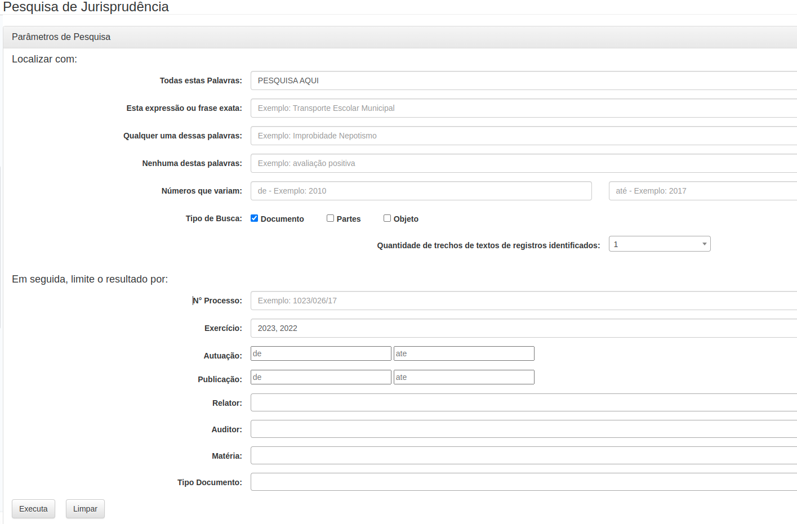

# Desafio RPA(Robotic Process Automation) - TURIVIUS

Desafio a ser apresentado para a empresa Turivius

## Objetivo
Objetivo do desafio é desenvolver um robô de automação de processos utilizando Python e as bibliotecas
requests_html, Selenium e Scrapy. O candidato deverá demonstrar habilidades em navegação web, extração de
dados e manipulação de informações, utilizando essas ferramentas.

## Descrição do desafio
O robô será responsável por extrair todos os documentos do site do TCE-SP, que sejam relacionados a “fraude em escolas” salvar esses dados em um formato adequado (por exemplo, CSV, JSON). 
O site para raspagem de dados é https://www.tce.sp.gov.br/jurisprudencia/

A imagem abaixo exibe uma sugestão de pesquisa

## Formato do arquivo de saída:

| Doc  | N processo|  Data Autuação |               Partes                  |     Matéria  |    URL     |
|------|-----------|----------------|---------------------------------------|--------------|------------|
| Desp | XXXXXXXXX | DD-MM-YYYY     |  [‘Parte a’, ‘parte b’, ‘parte c’]    |     EBDAp    | http:link  |
|      |    ...    |     ...        |              ...                      |     ...      |   ...      |
| Desp | XXXXXXXXX | DD-MM-YYYY     |  [‘Parte a’, ‘parte b’, ‘parte c’]    |     EBDAp    | http:link  |

## Requisitos:
1. Utilizar biblioteca raspagem de dados para fazer o scraping do site e extrair os dados necessários.
2. Priorizar performance na raspagem dos dados.
3. Extrair e salvar os dados em um banco de dados (Postgresql, MySQL e etc)
4. A modelagem da tabela no banco de dados deve ser otimizada para recuperação de informação baseada em data, matéria e Doc, ou seja através de index e outras estruturas de recuperação de informação.
5. O código deve ser pensado de modo a ser colocado em ambiente de produção, isto é com variaveis de ambiente localizadas em arquivos de separados (por exemplo, .env)
6. Documentar o código de forma clara e concisa, explicando a lógica por trás das ações realizadas.

## Critérios de Avaliação:
1. Funcionalidade: O robô deve ser capaz de extrair corretamente os dados do site fornecido
2. Qualidade do código: O código deve ser limpo, bem estruturado e seguir as melhores práticas de
desenvolvimento em Python, utilizando PEP8
3. Utilização eficaz das ferramentas: O candidato deve demonstrar habilidade no uso de pelo menos umas das seguintes bibliotecas: 
* requests_html 
* Selenium
* Scrapy
* BeautifulSoap(bs4)
4. Documentação: O código deve estar devidamente documentado, explicando a lógica por trás das ações
realizadas e qualquer configuração necessária.
5. Robustez: O robô deve ser capaz de lidar com situações de exceção de forma adequada, como falhas de
conexão ou mudanças na estrutura do site.

## Diferencial:
1. Uso preferencial: Implementar a solução utilizando request_html ou bs4;
2. Entrega da solução containerizada: Desenhar a solução para rodar em containers Docker/K8s;
3. Testes de Software: Desenvolver testes funcionais e de unidade para garantir funcionalidades esperadas;
4. SGBD orientados a Documento: Fazer o armazenamento das informações extraídas em algum dos seguintes banco
de dados como Mongo, Dynamodb ou engines como Opensearch/Elastisearch.

